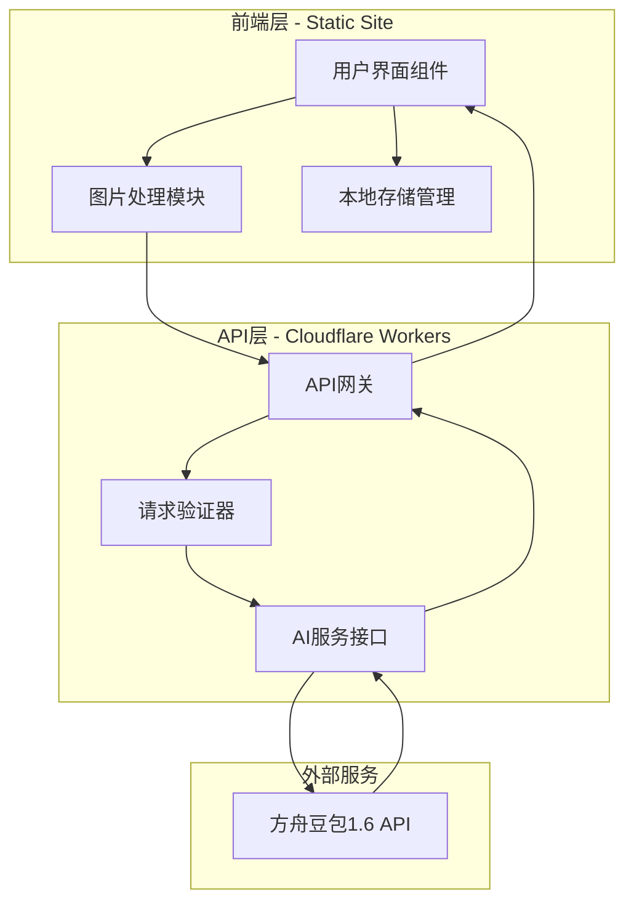
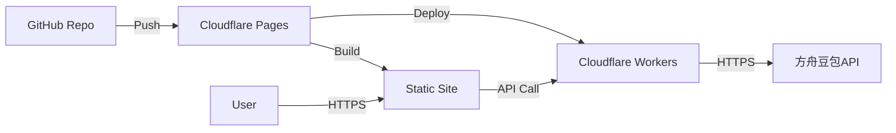

# 设计文档

## 概述

食物卡路里分析系统是一个基于Web的单页应用（SPA），采用前后端分离架构。前端使用现代JavaScript框架构建响应式用户界面，后端使用Serverless函数处理API请求和图片分析。系统集成方舟豆包1.6大模型进行食物识别和营养分析，支持部署到GitHub Pages或Cloudflare Pages等免费托管平台。

### 核心功能
- 图片上传和预处理（格式验证、压缩优化）
- 食物识别和分类
- 卡路里计算和营养成分分析
- 历史记录管理
- 响应式用户界面

### 技术栈
- **前端**: React + TypeScript + Vite
- **后端**: Cloudflare Workers (Serverless)
- **AI模型**: 方舟豆包1.6 API
- **存储**: LocalStorage (历史记录)
- **部署**: Cloudflare Pages
- **图片处理**: Browser Canvas API

## 架构

系统采用三层架构：



### 架构决策

1. **Serverless架构**: 使用Cloudflare Workers处理后端逻辑，避免服务器维护成本，符合免费部署要求
2. **前端图片预处理**: 在浏览器端完成图片压缩和格式转换，减少网络传输和API token消耗
3. **本地存储**: 使用LocalStorage保存历史记录，无需数据库，简化架构
4. **环境变量管理**: API密钥存储在Cloudflare Workers环境变量中，确保安全性

## 组件和接口

### 前端组件

#### 1. ImageUploader 组件
负责图片上传和预处理。

**接口**:
```typescript
interface ImageUploaderProps {
  onImageProcessed: (processedImage: ProcessedImage) => void;
  onError: (error: Error) => void;
}

interface ProcessedImage {
  dataUrl: string;
  originalSize: number;
  compressedSize: number;
  dimensions: { width: number; height: number };
  format: 'jpeg' | 'png' | 'webp';
}
```

**职责**:
- 验证文件格式（JPEG、PNG、WebP）
- 检查文件大小（最大10MB）
- 检测图片分辨率
- 压缩超过2MB或2048x2048的图片
- 生成预览

#### 2. AnalysisDisplay 组件
显示分析结果。

**接口**:
```typescript
interface AnalysisDisplayProps {
  result: AnalysisResult;
  onNewAnalysis: () => void;
}

interface AnalysisResult {
  foods: FoodItem[];
  totalCalories: number;
  timestamp: number;
  imageUrl: string;
  confidence?: string;
}

interface FoodItem {
  name: string;
  calories: number;
  nutrition: NutritionInfo;
}

interface NutritionInfo {
  protein: number;    // 克
  fat: number;        // 克
  carbs: number;      // 克
  fiber: number;      // 克
}
```

#### 3. HistoryList 组件
管理和显示历史记录。

**接口**:
```typescript
interface HistoryListProps {
  onSelectRecord: (record: AnalysisResult) => void;
}

interface HistoryStorage {
  saveRecord(record: AnalysisResult): void;
  getRecords(): AnalysisResult[];
  deleteRecord(timestamp: number): void;
  clearAll(): void;
}
```

#### 4. LoadingIndicator 组件
显示加载状态。

**接口**:
```typescript
interface LoadingIndicatorProps {
  message?: string;
  progress?: number;
}
```

### 后端API接口

#### POST /api/analyze
分析食物图片。

**请求**:
```typescript
interface AnalyzeRequest {
  image: string;  // Base64编码的图片
  format: string; // 图片格式
}
```

**响应**:
```typescript
interface AnalyzeResponse {
  success: boolean;
  data?: {
    foods: Array<{
      name: string;
      calories: number;
      nutrition: {
        protein: number;
        fat: number;
        carbs: number;
        fiber: number;
      };
    }>;
    totalCalories: number;
    confidence?: string;
  };
  error?: {
    code: string;
    message: string;
  };
}
```

### 方舟豆包API集成

#### 图片分析Prompt模板
```
你是一个专业的营养分析师。请分析这张食物图片，识别其中的食物并提供营养信息。

要求：
1. 识别图片中的所有食物
2. 对每种食物估算标准份量的营养成分
3. 以JSON格式返回结果

返回格式：
{
  "foods": [
    {
      "name": "食物名称",
      "calories": 卡路里数值（kcal）,
      "nutrition": {
        "protein": 蛋白质（克）,
        "fat": 脂肪（克）,
        "carbs": 碳水化合物（克）,
        "fiber": 膳食纤维（克）
      }
    }
  ],
  "confidence": "high/medium/low",
  "notes": "任何需要说明的信息"
}

如果图片中没有食物，返回：
{
  "foods": [],
  "confidence": "none",
  "notes": "未检测到食物"
}
```

## 数据模型

### AnalysisResult
存储在LocalStorage中的分析结果。

```typescript
interface AnalysisResult {
  id: string;              // UUID
  timestamp: number;       // Unix时间戳
  imageUrl: string;        // Base64或ObjectURL
  foods: FoodItem[];
  totalCalories: number;
  confidence?: string;
}
```

### FoodItem
单个食物项。

```typescript
interface FoodItem {
  name: string;
  calories: number;
  nutrition: NutritionInfo;
  portion?: string;        // 份量说明
}
```

### NutritionInfo
营养成分信息。

```typescript
interface NutritionInfo {
  protein: number;    // 蛋白质（克）
  fat: number;        // 脂肪（克）
  carbs: number;      // 碳水化合物（克）
  fiber: number;      // 膳食纤维（克）
}
```

### ImageMetadata
图片元数据。

```typescript
interface ImageMetadata {
  originalSize: number;
  compressedSize: number;
  dimensions: {
    width: number;
    height: number;
  };
  format: 'jpeg' | 'png' | 'webp';
}
```

## 正确性属性


*属性是一个特征或行为，应该在系统的所有有效执行中保持为真——本质上是关于系统应该做什么的正式声明。属性作为人类可读规范和机器可验证正确性保证之间的桥梁。*

### Property 1: 文件格式验证正确性
*对于任何*文件对象，验证函数应该接受JPEG、PNG、WebP格式的文件，并拒绝其他格式的文件
**Validates: Requirements 1.1**

### Property 2: 图片分辨率检测准确性
*对于任何*有效的图片文件，检测函数返回的分辨率应该与图片的实际宽度和高度匹配
**Validates: Requirements 1.3**

### Property 3: 高分辨率图片压缩
*对于任何*分辨率超过2048x2048的图片，压缩后的图片尺寸应该小于或等于2048x2048
**Validates: Requirements 1.4**

### Property 4: 大文件压缩
*对于任何*文件大小超过2MB的图片，压缩后的文件大小应该小于原始大小
**Validates: Requirements 1.5**

### Property 5: 压缩后预览可用性
*对于任何*成功压缩的图片，返回的数据应该包含有效的预览URL或DataURL
**Validates: Requirements 1.6**

### Property 6: API响应解析完整性
*对于任何*包含食物数据的API响应，解析函数应该正确提取所有食物名称
**Validates: Requirements 2.2**

### Property 7: 多食物列表完整性
*对于任何*包含多个食物的API响应，系统返回的食物列表长度应该等于响应中的食物数量
**Validates: Requirements 2.3**

### Property 8: 卡路里数据存在性
*对于任何*识别出的食物项，其数据结构应该包含卡路里字段且值为非负数
**Validates: Requirements 3.1**

### Property 9: 卡路里单位一致性
*对于任何*显示的卡路里值，其单位标注应该为"kcal"或"千卡"
**Validates: Requirements 3.2**

### Property 10: 卡路里总和正确性
*对于任何*包含多个食物的分析结果，总卡路里应该等于各个食物卡路里的总和
**Validates: Requirements 3.3**

### Property 11: 营养成分数据完整性
*对于任何*识别出的食物项，其营养信息应该包含蛋白质、脂肪、碳水化合物和膳食纤维四个字段
**Validates: Requirements 4.1, 4.2, 4.3, 4.4**

### Property 12: 营养成分结构化格式
*对于任何*食物的营养信息对象，应该具有标准的结构（包含protein、fat、carbs、fiber字段）
**Validates: Requirements 4.5**

### Property 13: 历史记录存储往返一致性
*对于任何*分析结果，保存到LocalStorage后再读取应该得到相同的数据（往返属性）
**Validates: Requirements 6.1**

### Property 14: 历史记录显示完整性
*对于任何*历史记录项，其显示数据应该包含缩略图URL、食物名称、卡路里值和时间戳
**Validates: Requirements 6.3**

### Property 15: 历史记录删除一致性
*对于任何*历史记录项，删除操作后从存储中查询该记录应该返回undefined或null
**Validates: Requirements 6.5**

### Property 16: API请求图片压缩验证
*对于任何*发送到API的图片数据，其大小应该小于或等于原始上传图片的大小
**Validates: Requirements 8.2**

### Property 17: 临时文件清理
*对于任何*处理完成的图片，服务器临时存储中不应该存在该文件
**Validates: Requirements 8.3**

### Property 18: 结果过滤正确性
*对于任何*分析结果，返回的食物列表中所有项的类型应该是食物相关的（非食物对象被过滤）
**Validates: Requirements 9.4**

## 错误处理

### 客户端错误处理

#### 1. 文件验证错误
- **场景**: 用户上传不支持的文件格式或超大文件
- **处理**: 
  - 显示友好的错误提示
  - 提供支持格式列表
  - 允许重新选择文件
- **错误代码**: `INVALID_FILE_FORMAT`, `FILE_TOO_LARGE`

#### 2. 图片处理错误
- **场景**: 图片损坏或无法解码
- **处理**:
  - 捕获Canvas API异常
  - 提示用户图片可能已损坏
  - 建议重新拍摄或选择其他图片
- **错误代码**: `IMAGE_DECODE_ERROR`, `COMPRESSION_FAILED`

#### 3. 网络错误
- **场景**: API请求失败、超时或网络断开
- **处理**:
  - 显示网络错误提示
  - 提供重试按钮
  - 保存用户数据避免丢失
- **错误代码**: `NETWORK_ERROR`, `REQUEST_TIMEOUT`

#### 4. 存储错误
- **场景**: LocalStorage已满或被禁用
- **处理**:
  - 提示用户清理历史记录
  - 提供导出功能
  - 降级到仅显示当前结果
- **错误代码**: `STORAGE_FULL`, `STORAGE_DISABLED`

### 服务端错误处理

#### 1. API密钥错误
- **场景**: 密钥未配置、无效或已过期
- **处理**:
  - 记录详细错误日志
  - 返回通用错误给前端
  - 触发告警通知开发者
- **错误代码**: `API_KEY_MISSING`, `API_KEY_INVALID`

#### 2. 方舟豆包API错误
- **场景**: API调用失败、限流或返回错误
- **处理**:
  - 实现指数退避重试（最多3次）
  - 记录API响应详情
  - 返回友好错误信息
- **错误代码**: `AI_API_ERROR`, `RATE_LIMIT_EXCEEDED`

#### 3. 图片处理错误
- **场景**: 图片格式不支持或处理失败
- **处理**:
  - 验证Base64解码
  - 检查图片尺寸合理性
  - 清理临时文件
- **错误代码**: `INVALID_IMAGE_DATA`, `PROCESSING_FAILED`

### 错误响应格式

所有API错误响应遵循统一格式：

```typescript
interface ErrorResponse {
  success: false;
  error: {
    code: string;
    message: string;
    details?: any;
    timestamp: number;
  };
}
```

## 测试策略

### 单元测试

使用Vitest作为测试框架，针对以下模块编写单元测试：

#### 1. 图片处理模块
- 测试文件格式验证函数
- 测试图片尺寸检测
- 测试压缩算法在边界条件下的行为
- 测试Base64编码/解码

**示例测试用例**:
```typescript
describe('ImageProcessor', () => {
  it('应该拒绝不支持的文件格式', () => {
    const file = new File([''], 'test.bmp', { type: 'image/bmp' });
    expect(() => validateFileFormat(file)).toThrow('INVALID_FILE_FORMAT');
  });
  
  it('应该接受JPEG格式', () => {
    const file = new File([''], 'test.jpg', { type: 'image/jpeg' });
    expect(validateFileFormat(file)).toBe(true);
  });
});
```

#### 2. 数据解析模块
- 测试API响应解析
- 测试营养数据提取
- 测试错误响应处理
- 测试空结果处理

#### 3. 存储模块
- 测试LocalStorage读写
- 测试数据序列化/反序列化
- 测试存储容量检查
- 测试记录删除

#### 4. 工具函数
- 测试日期格式化
- 测试数值计算（卡路里总和）
- 测试字符串处理

### 属性测试

使用fast-check库进行属性测试，验证系统在各种输入下的正确性：

#### 配置
- 每个属性测试运行至少100次迭代
- 使用随机种子确保可重现性
- 记录失败的反例

#### 测试生成器

**图片元数据生成器**:
```typescript
const imageMetadataArb = fc.record({
  width: fc.integer({ min: 100, max: 4096 }),
  height: fc.integer({ min: 100, max: 4096 }),
  size: fc.integer({ min: 1024, max: 10 * 1024 * 1024 }),
  format: fc.constantFrom('jpeg', 'png', 'webp')
});
```

**食物数据生成器**:
```typescript
const foodItemArb = fc.record({
  name: fc.string({ minLength: 1, maxLength: 50 }),
  calories: fc.integer({ min: 0, max: 2000 }),
  nutrition: fc.record({
    protein: fc.float({ min: 0, max: 100 }),
    fat: fc.float({ min: 0, max: 100 }),
    carbs: fc.float({ min: 0, max: 200 }),
    fiber: fc.float({ min: 0, max: 50 })
  })
});
```

**分析结果生成器**:
```typescript
const analysisResultArb = fc.record({
  id: fc.uuid(),
  timestamp: fc.integer({ min: 0, max: Date.now() }),
  imageUrl: fc.webUrl(),
  foods: fc.array(foodItemArb, { minLength: 0, maxLength: 10 }),
  totalCalories: fc.integer({ min: 0, max: 5000 })
});
```

#### 属性测试标注

每个属性测试必须包含注释，明确标注其对应的设计文档中的属性：

```typescript
// **Feature: food-calorie-analyzer, Property 10: 卡路里总和正确性**
it('总卡路里应该等于各食物卡路里之和', () => {
  fc.assert(
    fc.property(fc.array(foodItemArb), (foods) => {
      const result = calculateTotalCalories(foods);
      const expected = foods.reduce((sum, food) => sum + food.calories, 0);
      return result === expected;
    }),
    { numRuns: 100 }
  );
});
```

### 集成测试

#### 1. API集成测试
- 使用Mock Service Worker (MSW)模拟方舟豆包API
- 测试完整的请求-响应流程
- 测试错误场景和重试逻辑

#### 2. 端到端流程测试
- 测试从上传到显示结果的完整流程
- 测试历史记录的保存和读取
- 测试错误恢复流程

### 测试覆盖率目标

- 语句覆盖率: ≥ 80%
- 分支覆盖率: ≥ 75%
- 函数覆盖率: ≥ 85%
- 属性测试: 覆盖所有18个正确性属性

## 性能考虑

### 图片处理优化

1. **渐进式压缩**: 使用Canvas API的quality参数逐步降低质量直到满足大小要求
2. **Web Worker**: 将图片压缩放到Worker线程，避免阻塞UI
3. **缓存**: 缓存压缩后的图片，避免重复处理

### API调用优化

1. **请求去重**: 防止短时间内重复提交相同图片
2. **超时控制**: 设置30秒超时，避免长时间等待
3. **Token优化**: 
   - 压缩图片到最小可识别尺寸
   - 使用适当的图片质量参数
   - 限制图片最大尺寸为1024x1024

### 存储优化

1. **数据压缩**: 使用LZ-String压缩存储的JSON数据
2. **容量管理**: 
   - 限制历史记录最多50条
   - 自动清理超过30天的记录
   - 提供手动清理功能
3. **缩略图**: 存储小尺寸缩略图而非完整图片

### 加载性能

1. **代码分割**: 使用动态import按需加载组件
2. **资源预加载**: 预加载关键资源
3. **懒加载**: 历史记录列表使用虚拟滚动

## 安全考虑

### 前端安全

1. **输入验证**: 严格验证文件类型和大小
2. **XSS防护**: 使用React的自动转义，避免dangerouslySetInnerHTML
3. **CSP策略**: 配置Content Security Policy限制资源加载

### 后端安全

1. **API密钥保护**: 
   - 存储在环境变量
   - 不在日志中输出
   - 定期轮换
2. **请求验证**: 
   - 验证请求来源
   - 限制请求大小
   - 实现速率限制
3. **数据清理**: 
   - 处理完成后立即删除临时文件
   - 不记录用户图片内容
   - 最小化日志信息

### HTTPS

所有通信必须使用HTTPS：
- Cloudflare Pages自动提供SSL证书
- API请求强制使用HTTPS
- 混合内容策略设置为block

## 部署架构

### Cloudflare Pages部署



### 部署配置

#### 1. 前端构建
```json
{
  "build": {
    "command": "npm run build",
    "output": "dist"
  }
}
```

#### 2. Workers配置
```toml
name = "food-analyzer-api"
main = "src/worker.ts"
compatibility_date = "2024-01-01"

[env.production]
vars = { ENVIRONMENT = "production" }

[env.production.secrets]
DOUBAO_API_KEY = "从环境变量读取"
```

#### 3. 环境变量
- `DOUBAO_API_KEY`: 方舟豆包API密钥
- `DOUBAO_API_ENDPOINT`: API端点URL
- `MAX_IMAGE_SIZE`: 最大图片大小（字节）
- `RATE_LIMIT`: 速率限制配置

### CI/CD流程

1. **代码提交**: 推送到GitHub main分支
2. **自动构建**: Cloudflare Pages自动触发构建
3. **运行测试**: 执行单元测试和属性测试
4. **部署**: 测试通过后自动部署
5. **验证**: 运行smoke test验证部署

### 监控和日志

1. **Cloudflare Analytics**: 监控访问量和性能
2. **Workers日志**: 记录API调用和错误
3. **错误追踪**: 集成Sentry或类似服务
4. **性能监控**: 使用Web Vitals追踪用户体验指标

## 技术债务和未来改进

### 短期改进
1. 添加更多图片格式支持（HEIC、AVIF）
2. 实现离线缓存（Service Worker）
3. 添加多语言支持

### 中期改进
1. 支持批量上传和分析
2. 添加食物数据库本地缓存
3. 实现用户账户系统（可选）
4. 导出历史记录为CSV/PDF

### 长期改进
1. 训练自定义食物识别模型
2. 添加营养建议和饮食计划功能
3. 集成健康追踪API（如Apple Health）
4. 开发移动应用
